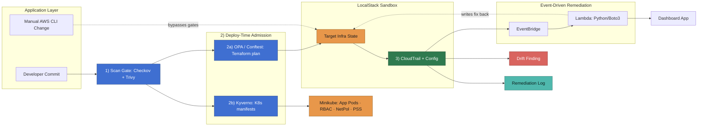

# Automated Cloud Security Remediation with IaC Scanning and Admission Control

A security-gated CI/CD pipeline for a containerized app on AWS
([LocalStack](https://www.localstack.io/)) and Kubernetes (minikube).

Four checkpoints, each demonstrated working against a deliberately
vulnerable target: static scanning before deploy, policy-as-code
admission control on both the Terraform plan and the Kubernetes
manifest, and event-driven auto-remediation for what gets past them.
Runs at $0 — no real AWS account, no paid tier.

## Problem

Cloud misconfigurations such as overly permissive IAM roles, unencrypted or
public storage, and unpatched container images remain the leading cause of
cloud security breaches. Most teams only catch them after the fact through a
scheduled audit, a manual review, or an incident. By the time a
misconfiguration is discovered it may have been live in production for
weeks, and fixing it depends on someone noticing, filing a ticket, and
eventually getting to it. Small teams shipping SaaS products feel this most
acutely since they rarely have a dedicated security engineer, so
infrastructure and application changes go out with no automated check
beyond a teammate glancing at a pull request.

## Solution

This project closes that gap by enforcing security at four checkpoints
instead of one, demonstrated end to end against a realistic target: a
customer analytics and reporting SaaS product called Northbound Analytics,
deployed on Terraform managed AWS infrastructure and Kubernetes.

Before deployment, Checkov and Trivy scan the infrastructure code and the
container image. At deploy time the path splits: OPA with conftest
evaluates the real `terraform plan` before it can apply, and Kyverno
evaluates Kubernetes manifests as a live admission webhook — a change is
refused at the API server rather than reported after the fact. After
deployment, a compliance event routes through EventBridge to a Lambda
that restores the baseline automatically, covering the case that matters
most: someone bypassing the pipeline entirely with a direct API call.

A separate dashboard collects findings from every gate and reports a
live compliance score, the open findings list, and mean time to
remediate. It is built to refuse to lie: a scanner that crashes is
recorded as inconclusive rather than clean, because a broken pipeline
rendering as a green board is the worst failure a security dashboard
has.

## Architecture Diagram



Checkov and Trivy gate both deploy paths at checkpoint 1, then the path splits:
OPA/Conftest gates everything landing in LocalStack (2a) while Kyverno gates
everything landing in Minikube (2b). CloudTrail and Config are checkpoint 3,
catching what the first two missed, including the manual CLI change shown as
the dashed bypass edge. Detection fires remediation through EventBridge and a
Lambda function instead of a polling script, and its dashed edge back into
Target Infra State is the fix actually landing. Kyverno only guards
admission — Kubernetes drift after deploy isn't monitored in this version.

## Repo layout

```
.github/
  workflows/           # GitHub Actions: scan gate + admission gate pipelines
infra/
  bootstrap/           # one-time: creates the Terraform state bucket + lock table
  environments/dev/    # AWS infrastructure (IAM, VPC, S3, Secrets Manager)
k8s/
  base/                # Deployment, Service manifests for the target app
  policy/              # RBAC, NetworkPolicy, PodSecurityStandards manifests
policies/
  opa/                 # conftest/OPA policies evaluated against terraform plan
  kyverno/             # Kyverno ClusterPolicy manifests for K8s admission
app/                   # target app: Northbound Analytics (seeded OWASP flaws)
dashboard/             # findings/compliance reporting dashboard
remediation/
  lambda/              # Python/Boto3 Lambda, triggered by EventBridge
scripts/
  setup-day1.sh        # LocalStack + Terraform remote state backend
  inject-drift.sh      # bypasses the pipeline to trigger the remediation loop
  sync-findings.py     # pulls findings from every gate into the dashboard
  demo.sh              # runs all four checkpoints end to end
docs/
  findings/            # real captured output from each phase
  threat-model.md      # STRIDE pass, including what is not mitigated
```

## Running it

**Prerequisites:** Docker, Terraform >= 1.5, AWS CLI, Java 21, Maven,
minikube, helm, conftest, and `gh` (authenticated). LocalStack Pro is
*not* required — see "A note on scope".

```bash
# 1. LocalStack + Terraform remote state backend
./scripts/setup-day1.sh

# 2. The rest of the infrastructure (IAM, VPC, S3, Config, CloudTrail,
#    EventBridge, the remediation Lambda)
cd infra/environments/dev && terraform init && terraform apply

# 3. Kubernetes + admission control
minikube start --driver=docker
helm repo add kyverno https://kyverno.github.io/kyverno/
helm install kyverno kyverno/kyverno -n kyverno --create-namespace
kubectl wait --for=condition=Ready pods --all -n kyverno --timeout=180s
kubectl apply -f k8s/base/namespace.yaml
kubectl apply -f k8s/base/ -f k8s/policy/ -f policies/kyverno/

# 4. The dashboard
cd dashboard && mvn spring-boot:run      # http://localhost:8090
```

Then run the whole thing end to end:

```bash
./scripts/demo.sh
```

That exercises every checkpoint in order — CI scan results, both
admission gates refusing a change, a pipeline-bypassing drift injection
being detected and auto-remediated — and finishes by syncing everything
into the dashboard.

## What each piece does

| Path | Role |
|---|---|
| `app/` | **The target.** Northbound Analytics, a Spring Boot API with four deliberately seeded flaws (broken auth, SQL injection, path traversal, hardcoded secret). See `app/README.md` for working exploits for each. |
| `infra/environments/dev/` | The AWS resources being protected, plus the detection and remediation wiring. Carries seeded misconfigurations on purpose. |
| `.github/workflows/` | Checkpoint 1 (Checkov + Trivy) and checkpoint 2a (OPA/conftest against the terraform plan). Both fail closed. |
| `policies/opa/` | Rego policies evaluated against a real `terraform plan`. Broader than Checkov here: they check the CIDR itself rather than a fixed port list. |
| `policies/kyverno/` | Checkpoint 2b. Live admission control — currently rejecting the app's deployment at the API server. |
| `k8s/` | The app as Kubernetes manifests, plus RBAC (zero permissions) and a default-deny NetworkPolicy. |
| `remediation/lambda/` | Checkpoint 3's response half. Restores the S3 baseline and records each fix to the audit bucket. |
| `dashboard/` | Collects findings from every gate and reports compliance score, open findings and MTTR. |
| `docs/findings/` | Real captured output from each phase — not descriptions of intended behaviour. |
| `docs/threat-model.md` | STRIDE pass, including what is *not* mitigated. |

## Current posture

From the most recent end-to-end run:

| Metric | Value |
|---|---|
| Compliance score | **56%** — 45 open of 102 policy checks |
| Open vulnerabilities | 7 (Trivy, reported separately from the score) |
| Mean time to remediate | 110s |

The seeded flaws are genuinely still present, which is why the number is
not higher. Two things are deliberately left in a failing state as
standing evidence the gates work: the IAM wildcard policy and the open
security-group ports are caught on every run by two independent gates,
and Kyverno's rejection of the app deployment is never overridden.

## Known gaps

Stated here rather than buried, because a security project that hides
its own gaps is making the argument for the wrong thing:

- **Detection is not enforcement.** No branch protection rule exists and
  `terraform apply` is run manually, so a developer can watch every gate
  fail and deploy anyway.
- **AWS Config never evaluates locally.** LocalStack mocks it — resources
  are created but nothing is recorded or evaluated. The drift demo
  publishes the Config event that real AWS would emit; everything
  downstream of that event is real.
- **The dashboard trusts its input.** Ingestion is unauthenticated.
- **One drift event can produce two remediation records**, because
  EventBridge assigned two deliveries different IDs.
- **Kubernetes drift after admission is not monitored.** Kyverno guards
  what gets in, not what changes afterwards.

## A note on scope

This project runs on LocalStack. AWS Config is mocked there — it accepts
resource creation but never records or evaluates anything, which is
documented in `docs/findings/phase-5-remediation-results.md` along with
how it was verified. Everything else (S3, IAM, EC2/VPC, Lambda,
EventBridge, CloudTrail, CloudWatch Logs) behaves for real.

No skill in this repo is claimed without something concrete backing it.
Every phase has a findings document in `docs/findings/` containing actual
command output, including the bugs found along the way and the ones still
open.
