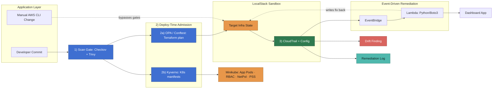

# Automated Cloud Security Remediation with IaC Scanning and Admission Control

A secure CI/CD pipeline for a containerized app on AWS (LocalStack)

A cloud security / DevSecOps portfolio project: a small Spring Boot app deployed
through a security-gated CI/CD pipeline onto AWS infrastructure defined as code.
Built primarily against [LocalStack](https://www.localstack.io/) to keep cost at
effectively $0, with a short, clearly-labeled window on real AWS for the two or
three managed services (GuardDuty, Security Hub) that LocalStack's free tier
doesn't emulate.

## Problem

Cloud misconfigurations such as overly permissive IAM roles, unencrypted or
public storage, and unpatched container images remain the leading cause of
cloud security breaches. Most teams only catch them after the fact through a
scheduled audit, a manual review, or an incident. By the time a
misconfiguration is discovered it may have been live in production for
weeks, and fixing it depends on someone noticing, filing a ticket, and
eventually getting to it. Small teams shipping SaaS products feel this most
acutely since they rarely have a dedicated security engineer, so
infrastructure and application changes go out with no automated check
beyond a teammate glancing at a pull request.

## Solution

This project closes that gap by enforcing security at three checkpoints
instead of one, demonstrated end to end against a realistic target: a
customer analytics and reporting SaaS product called Northbound Analytics,
deployed on Terraform managed AWS infrastructure.

Before deployment, Checkov and Trivy scan the infrastructure code and
container image for known issues, and OPA with conftest evaluates every
planned change against policy before it can apply. Only changes that pass
every gate reach LocalStack, where the pipeline runs at zero cost and zero
risk to a real AWS account. After deployment, CloudTrail and Config watch
for drift, including a deliberately injected manual change that bypasses
the pipeline, and a Boto3 script automatically remediates it.

A separate dashboard reports on all three checkpoints: scan results,
policy decisions, and remediation actions, presented as a live compliance
score, an open findings list, and a mean time to remediate metric.

## Architecture Diagram



Checkov and Trivy gate both deploy paths at checkpoint 1, then the path splits:
OPA/Conftest gates everything landing in LocalStack (2a) while Kyverno gates
everything landing in Minikube (2b). CloudTrail and Config are checkpoint 3,
catching what the first two missed, including the manual CLI change shown as
the dashed bypass edge. Detection fires remediation through EventBridge and a
Lambda function instead of a polling script, and its dashed edge back into
Target Infra State is the fix actually landing. Kyverno only guards
admission — Kubernetes drift after deploy isn't monitored in this version.

## Repo layout

```
.github/
  workflows/           # GitHub Actions: scan gate + admission gate pipelines
infra/
  bootstrap/           # one-time: creates the Terraform state bucket + lock table
  environments/dev/    # AWS infrastructure (IAM, VPC, S3, Secrets Manager)
k8s/
  base/                # Deployment, Service manifests for the target app
  policy/              # RBAC, NetworkPolicy, PodSecurityStandards manifests
policies/
  opa/                 # conftest/OPA policies evaluated against terraform plan
  kyverno/             # Kyverno ClusterPolicy manifests for K8s admission
app/                   # target app: Northbound Analytics (seeded OWASP flaws)
dashboard/             # findings/compliance reporting dashboard
remediation/
  lambda/              # Python/Boto3 Lambda, triggered by EventBridge
scripts/               # setup and helper scripts
docs/
  findings/            # screenshots of scan/posture results
  threat-model.md      # STRIDE pass (added Day 7)
```

## Day 1 — Environment Setup

**Prerequisites:** Docker, Terraform >= 1.5, AWS CLI, git.

1. Start LocalStack and bootstrap Terraform state in one step:

   ```bash
   ./scripts/setup-day1.sh
   ```

   This does three things:
   - Brings up LocalStack (`docker-compose up -d`), emulating S3, DynamoDB,
     IAM, STS, EC2, Lambda, EventBridge, CloudTrail, and Secrets Manager on
     `localhost:4566`
   - Runs `infra/bootstrap` (using a local Terraform backend) to create the
     `cloudguard-tf-state` S3 bucket and `cloudguard-tf-lock`
     DynamoDB table *inside* LocalStack
   - Switches to `infra/environments/dev`, points it at that new remote
     backend, and applies a one-resource smoke test to confirm the whole
     chain works end to end

2. Verify manually if you want to see it yourself:

   ```bash
   curl http://localhost:4566/_localstack/health
   aws --endpoint-url=http://localhost:4566 s3 ls
   ```

   You should see `cloudguard-tf-state` and `cloudguard-day1-smoke-test`
   listed.

**What "done" looks like for Day 1:** LocalStack running, Terraform remote
state backend live inside it, and a successful `terraform apply` against
that backend. Nothing here touches real AWS or costs anything.

## Roadmap

| Day | Focus |
|---|---|
| 1 | Workspace scaffolding + LocalStack setup *(this stage)* |
| 2 | IAM least-privilege roles, permission boundaries, SCPs, CloudTrail, Config |
| 3 | VPC segmentation, Spring Boot app with seeded OWASP Top 10 flaws, hardened Dockerfile |
| 4 | Secrets Manager, Prowler/Checkov posture scans |
| 5 | GitHub Actions pipeline: Checkov, SonarQube, Snyk, Trivy quality gates; Kyverno/OPA admission policy |
| 6 | Boto3 remediation script, full pipeline run |
| 7 | Threat model, architecture diagram, README polish, GitHub launch |

## A note on scope

This project runs almost entirely on LocalStack's free Community tier.
AWS Config, GuardDuty, and Security Hub are AWS-managed services that
LocalStack's free tier doesn't emulate — where this project references them,
the README says explicitly whether that stage ran against real AWS
(budget-capped) or was substituted with an open-source equivalent
(Checkov, Prowler). No skill in this repo is claimed without something
concrete backing it.
